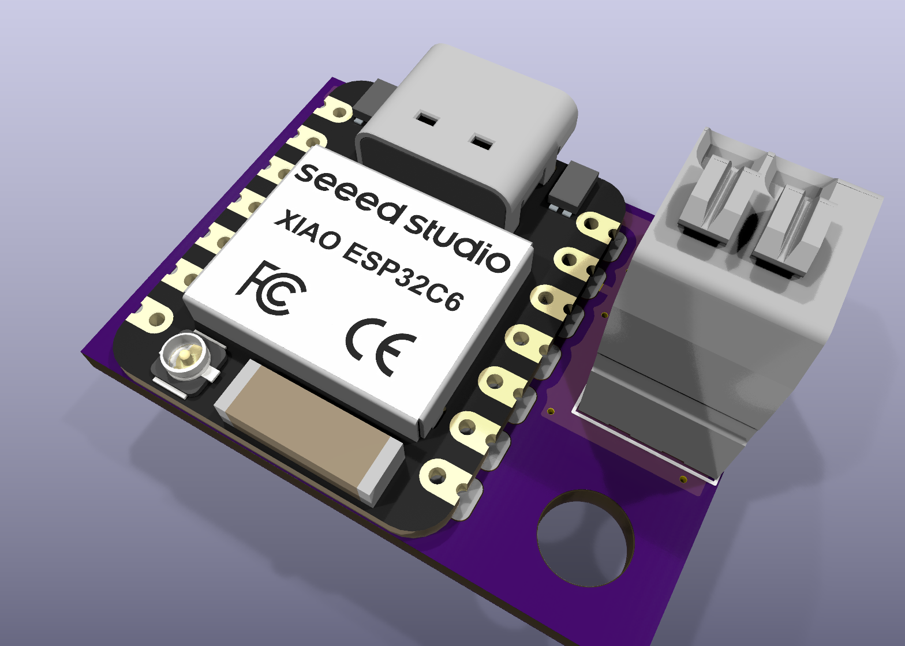
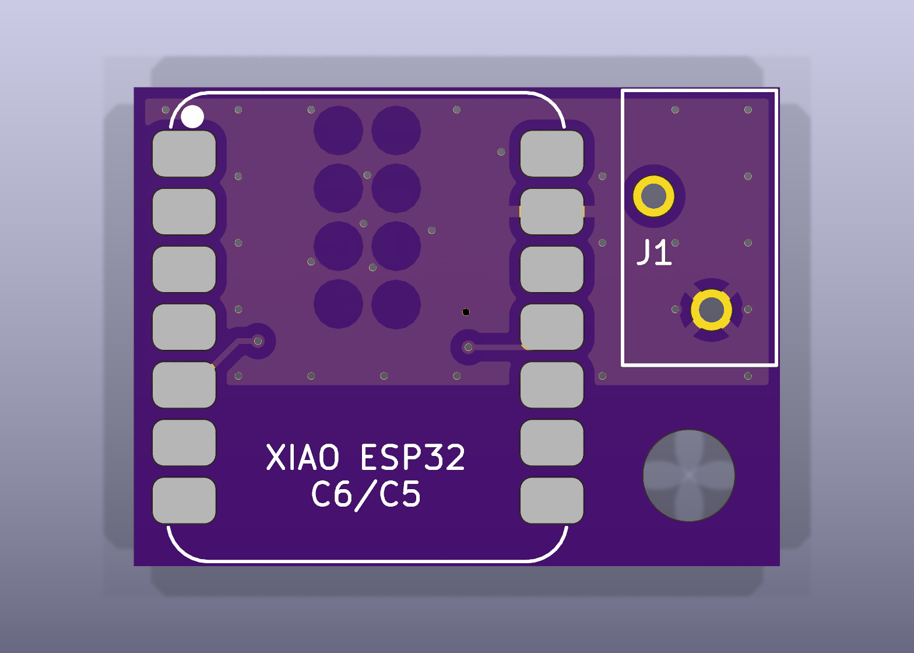
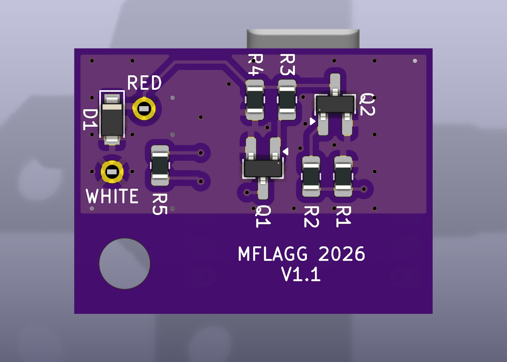

# Seeed XIAO ESP32-C6 / ESP32-C5 KiCad files

> [!WARNING]
> **This board has not been built or tested yet, and it is provided without support.** It passes KiCad's electrical rules check and design rules check, but it has never controlled a garage door. Use it at your own risk.




A small (28.4 × 21.05 mm, 2-layer) Security+ 2.0 interface based on this repository's D1 Mini - ESP32 board, built around a surface-mounted [Seeed Studio XIAO ESP32-C6](https://wiki.seeedstudio.com/xiao_esp32c6_getting_started/). It connects to only the RED and WHITE wall-control wires, and the XIAO is powered from its own USB-C port.

- Schematic: [c6gdo-schematic.pdf](c6gdo-schematic.pdf) (source: `c6gdo.kicad_sch`)
- Bill of materials: [BOM.md](BOM.md) / [BOM.csv](BOM.csv)

## Firmware

The board was designed for the ESPHome [`secplus_gdo`](https://github.com/gelidusresearch/esphome-secplus-gdo) component. That component inverts the UART, which matches the two inverting MOSFET stages on this board.

Obstruction status comes from the Security+ 2.0 serial protocol, so no obstruction pin is configured.

An example ESPHome YAML would be an adaptation of `grgdov3-board-secplus-gdo-thread.yaml`, found [here](https://github.com/GelidusResearch/grgdo). Note that you will at a minimum need to remap the UART pins and change the board/variant to match.

```yaml
substitutions:
  uart_tx_pin: GPIO22 # D4
  uart_rx_pin: GPIO18 # D10

esp32:
  board: seeed_xiao_esp32c6
  flash_size: 4MB
  variant: esp32c6
  framework:
    type: esp-idf
```

## XIAO ESP32-C5 compatibility

This board was designed for the XIAO ESP32-C6. The pinouts are also chosen for XIAO ESP32-C5 compatibility. I'm unsure of precedent for the GDO firmware- it may or may not function on C5.

If you populate a C5 instead of a C6, use this in place of the substitutions/esp32 block above:

```yaml
substitutions:
  uart_tx_pin: GPIO23 # D4
  uart_rx_pin: GPIO10 # D10

esp32:
  board: seeed_xiao_esp32c5
  flash_size: 8MB
  variant: esp32c5
  framework:
    type: esp-idf
```

## Changes from the D1 Mini - ESP32 board

The starting point is [`kicad_files/D1 Mini - ESP32`](../D1%20Mini%20-%20ESP32). The core of that design is kept as is:
- Q1 (2N7002) with a 10k series resistor into its gate for RX.
- Q2 (AO3400A) with a 1k gate resistor for TX.
- A pulldown on the TX GPIO.
- A bias resistor from RED to ground.
- No power circuitry on the board (the module is powered over its own USB).

The changes are:

| | D1 Mini - ESP32 | This board | Notes |
|-|-|-|-|
| MCU | Wemos D1 Mini ESP32: TX IO22 (D1), RX IO21 (D2) | Seeed XIAO ESP32-C6: TX GPIO22 (D4), RX GPIO18 (D10) | Smaller module with WiFi 6 / Thread. Neither pin is a C6 strapping pin, and neither conflicts with the console UART, USB-JTAG or the antenna switch. D4/D10 were chosen (instead of D3/D10) so the same board also works with a XIAO ESP32-C5 — see [XIAO ESP32-C5 compatibility](#xiao-esp32-c5-compatibility). |
| RX pull-up | None | **R5** 10k to 3V3 (new) | gdolib never enables an internal pull-up on the RX pin, so without R5 the pin floats when Q1 is off. |
| TX GPIO pulldown | 10k | **R1** 4.7k | Keeps Q2 off while the ESP32 is in reset. In reset the pin's ~45 kΩ internal pull-up is enabled, which with the old 10k pulldown would set Q2's gate to about 3.3 V × 10k / 55k ≈ 0.60 V. That is just under the AO3400A's minimum turn-on threshold of 0.65 V (0.65–1.45 V). With 4.7k the gate sits at about 0.31 V. |
| RED bias to ground | 10k | **R4** 100k | Lighter load on the opener's line: about 0.13 mA instead of 1.3 mA at 12.7 V. |
| Transient protection | None | **D1** PTVS15VS1UR 15 V, 400 W unidirectional TVS (new) | Clamps transients on the wire run to the opener. |
| Obstruction | IO23 through a 10k series resistor and 10k pulldown | Removed | Obstruction status is read from the Security+ 2.0 serial protocol. |
| Connector | Three 3-pole footprint options (5.00 mm screw terminal, 3.5 mm Phoenix MCV, 2.54 mm header) | One 2-pole WAGO 250-1402 push-button terminal | Only RED and WHITE are needed. Accepts 20-24 AWG. |

## Wiring and mounting

- **J1 RED** → opener's red wall-control terminal. **J1 WHITE** → opener's white terminal (ground). The labels are on the back silkscreen.
- Power the XIAO from any USB-C supply.
- Mount it with a #6-32 × 1" nylon screw through the 4.0 mm hole into a SnapSkru SPM Mini drywall anchor (see the BOM).
  - M3.5 should also work for the mounting screw.
  - I strongly recommend against a metallic screw in this position. It may interfere with the antenna.

## PCB notes

- The XIAO sits on the top side, flush with the bottom board edge. All other parts are on the back.
- The XIAO's underside pads (24–33) are **not soldered**. The footprint has no copper for them; instead it marks each one with an F.Fab outline and a rule area, so DRC flags any via placed there. The top-layer ground fill also stays out of these areas, so a flaw in the solder mask can't short a signal or power pad to ground. These pads are also left off the schematic symbol.
- Both copper layers are ground-filled, and both fills stop at y = 55 mm, leaving the board under the XIAO's antenna end free of copper.
- Stitching vias tie the two ground fills together. Most sit on a regular 3.2 mm grid, including a row along the fill edge nearest the antenna, with a few extra vias between the parts in the center. The spacing comes from the WiFi wavelength:
  - A 2.4 GHz signal has a wavelength (λ) of about 125 mm in air, or roughly 60–70 mm in FR4.
  - A common rule of thumb keeps stitching vias no more than λ/20–λ/10 apart, about 3–6 mm. That way no patch of copper is large enough to act as a resonator or slot antenna at WiFi frequencies.
  - On this board, no point where both layers are filled is more than about 3.2 mm from a stitching via.
- Under the XIAO's two rows of edge pads, only the bottom layer is ground-filled, since the top layer holds the pads. These bottom-only strips are about 4 mm wide. Each one is joined to the rest of the bottom fill along its full length, and a column of vias runs along its inner edge. So each strip is part of the ground plane rather than a separate flap, and it is far too small to resonate at 2.4 GHz (a quarter wavelength is about 15–17 mm in FR4).

## Project layout

Everything the project uses is inside this folder. Symbols, footprints and 3D models are referenced through `${KIPRJMOD}` via the project's own `sym-lib-table` and `fp-lib-table`, so the folder can be moved or renamed and opened on another machine without extra library setup.

```
c6gdo.kicad_pro / .kicad_sch / .kicad_pcb   KiCad 10 project
c6gdo-schematic.pdf                          schematic export
BOM.md, BOM.csv                              bill of materials
gerbers/                                     Gerber + Excellon drill files
c6gdo-gerbers.zip                            the same files, zipped for upload to a PCB fab
lib/c6gdo.kicad_sym                          project symbol library
lib/c6gdo.pretty/                            project footprint library
lib/c6gdo.3dshapes/                          3D models (STEP/IGES)
images/                                      3D renders
```

The files require **KiCad 10**. The Gerbers match the current board. After any board change, re-export them: copper, mask, paste, silkscreen and Edge.Cuts layers, plus separate PTH/NPTH Excellon drill files.

Sources:
- **XIAO symbol and footprint:** derived from Seeed Studio's official XIAO KiCad library.
- **XIAO 3D model** (`lib/c6gdo.3dshapes/seeed-studio-xiao-esp32c6-v2.step`): "[3D model for Seeed Studio XIAO ESP32C6](https://www.printables.com/model/1338408-3d-model-for-seeed-studio-xiao-esp32c6)" from Printables. It is licensed under [CC BY-SA 4.0](https://creativecommons.org/licenses/by-sa/4.0/) and included unmodified.
- **WAGO footprint and 3D model:** from the [250-1402 Ultra Librarian CAD download on DigiKey](https://www.digikey.com/en/models/15551338?tab=ultralibrarian).
- **Everything else:** the remaining footprints and 3D models come from the standard KiCad libraries.
